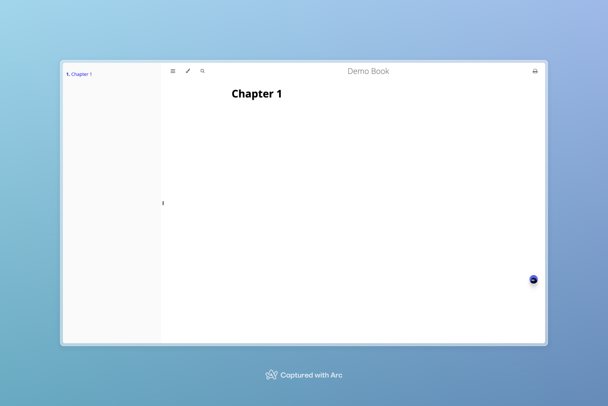

# 18.5k 开源 Markdown 书写技术文档的利器 mdBook 

AI时代来临后，有Github Copilot和众多国内AI辅助编程插件的加持下，最近更有神器Cursor让你的编辑器无比强大。在编辑器中编写文章或博客变得非常简单，与其等待各个Markdown软件的AI能力，不如直接使用AI加持下的编辑器来写作，今天给大家带来的就是一个可以通过编辑器写作的神器。

mdBook是一个轻量级、高性能的开源Markdown工具，专为技术文档编写设计。它易于使用，完全兼容标准Markdown语法，并支持高级特性如LaTeX公式和自定义CSS。mdBook高度可定制，允许自定义模板和主题，内置测试框架确保文档准确性。它跨平台支持，社区活跃，并且可以输出HTML、PDF等多种格式，满足不同需求。

https://github.com/rust-lang/mdBook


## 安装

首先，确保安装了Rust，如果没有安装，可以通过下面的命令安装

```bash
curl --proto '=https' --tlsv1.2 -sSf https://sh.rustup.rs | sh
```

### 安装 MdBook

```bash
cargo install mdbook
```

### 创建一本书

初始化并渲染

```bash
mdbook init my-first-book
cd my-first-book
mdbook serve --open
```

渲染一本书的方法有很多种，但最简单的方法之一是使用 serve 命令，它将构建你的书并启动一个本地 Web 服务器，--open 选项将打开您的默认 Web 浏览器以查看您的新图书。即使在编辑书籍内容时，您也可以让服务器保持运行状态，mdbook 将自动重建输出并自动刷新您的 Web 浏览器。




### 项目结构分析

我们来通过tree命令来输出项目结构，结果如下：

```bash
.
├── book.toml
└── src
    ├── SUMMARY.md
    └── chapter_1.md

2 directories, 3 files
```

我们可以发现根目录中，有一个 book.toml 文件，其中包含用于描述如何构建书籍的设置。这是用 TOML 标记语言编写的。

一个非常基本的 book.toml 可以像这样简单：

```toml
[book]
title = "My First Book"
```

### SUMMARY.md

书籍的下一个主要部分是位于 src/SUMMARY.md 的摘要文件。此文件包含书中所有章节的列表。必须先将其添加到此列表中，然后才能查看章节。

下面是一个包含几章的基本摘要文件：

# Summary

```md
[Introduction](README.md)

- [My First Chapter](my-first-chapter.md)
- [Nested example](nested/README.md)
    - [Sub-chapter](nested/sub-chapter.md)
```

尝试在编辑器中打开 src/SUMMARY.md 并添加一些章节。如果任何章节文件不存在，mdbook 将自动为您创建它们。

### 源文件

你的书的内容都包含在 src 目录中。每个章节都是一个单独的 Markdown 文件。通常，每章都以带有章节标题的 1 级标题开头。

```md
# My First Chapter

Fill out your content here.
```

### 发布你的书籍

写完书后，您可能希望将其托管在某个地方供其他人查看。第一步是构建这本书的输出。这可以通过 book.toml 文件所在的同一目录中的 mdbook build 命令来完成：

mdbook build
这将生成一个名为 book 的目录，其中包含您书籍的 HTML 内容。然后，您可以将此目录放在任何 Web 服务器上以托管它。

发布后的目录结构如下

```bash
.
├── book
│   ├── 404.html
│   ├── FontAwesome
│   │   ├── css
│   │   │   └── font-awesome.css
│   │   └── fonts
│   │       ├── FontAwesome.ttf
│   │       ├── fontawesome-webfont.eot
│   │       ├── fontawesome-webfont.svg
│   │       ├── fontawesome-webfont.ttf
│   │       ├── fontawesome-webfont.woff
│   │       └── fontawesome-webfont.woff2
│   ├── ayu-highlight.css
│   ├── book.js
│   ├── chapter_1.html
│   ├── clipboard.min.js
│   ├── css
│   │   ├── chrome.css
│   │   ├── general.css
│   │   ├── print.css
│   │   └── variables.css
│   ├── elasticlunr.min.js
│   ├── favicon.png
│   ├── favicon.svg
│   ├── fonts
│   │   ├── OPEN-SANS-LICENSE.txt
│   │   ├── SOURCE-CODE-PRO-LICENSE.txt
│   │   ├── fonts.css
│   │   ├── open-sans-v17-all-charsets-300.woff2
│   │   ├── open-sans-v17-all-charsets-300italic.woff2
│   │   ├── open-sans-v17-all-charsets-600.woff2
│   │   ├── open-sans-v17-all-charsets-600italic.woff2
│   │   ├── open-sans-v17-all-charsets-700.woff2
│   │   ├── open-sans-v17-all-charsets-700italic.woff2
│   │   ├── open-sans-v17-all-charsets-800.woff2
│   │   ├── open-sans-v17-all-charsets-800italic.woff2
│   │   ├── open-sans-v17-all-charsets-italic.woff2
│   │   ├── open-sans-v17-all-charsets-regular.woff2
│   │   └── source-code-pro-v11-all-charsets-500.woff2
│   ├── highlight.css
│   ├── highlight.js
│   ├── index.html
│   ├── mark.min.js
│   ├── print.html
│   ├── searcher.js
│   ├── searchindex.js
│   ├── searchindex.json
│   ├── toc.html
│   ├── toc.js
│   └── tomorrow-night.css
├── book.toml
└── src
    ├── SUMMARY.md
    └── chapter_1.md

8 directories, 47 files
```


